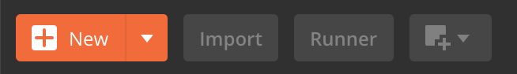
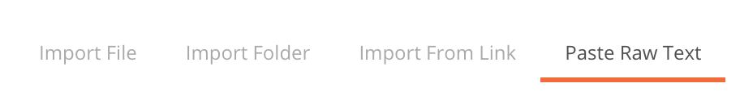
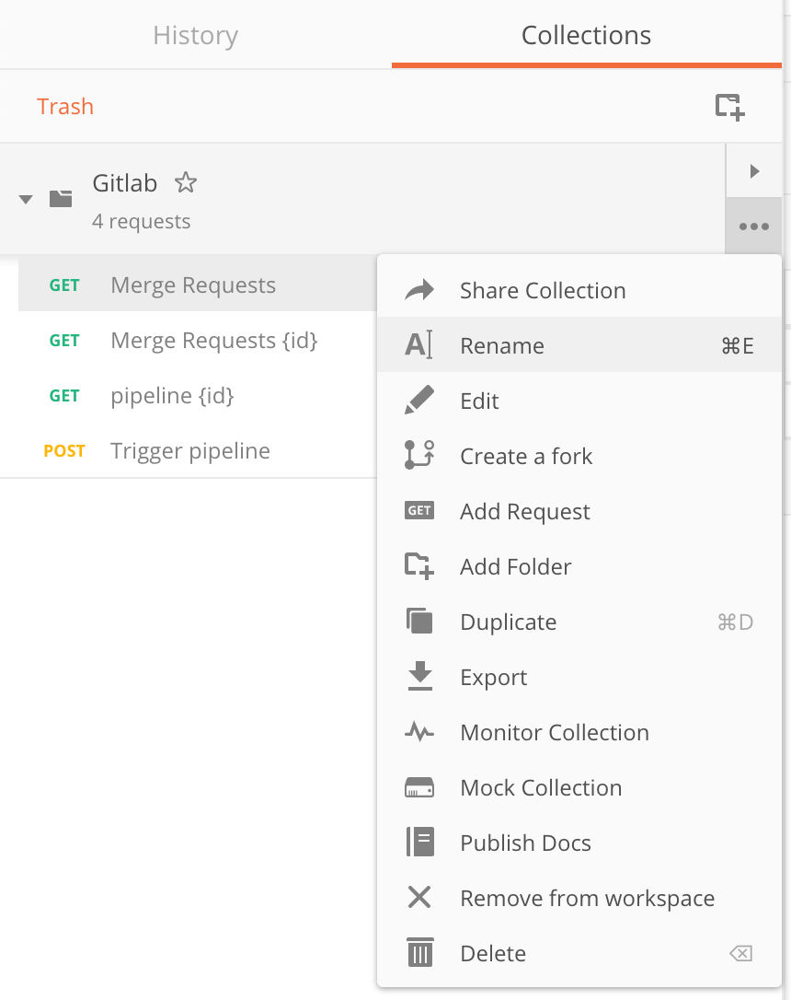

# Postman Collections

A community generated list of Postman Collection

Site available at : [https://nervous-torvalds-400a98.netlify.com/](https://nervous-torvalds-400a98.netlify.com/)

## How to use

1. Follow this link [https://nervous-torvalds-400a98.netlify.com/](https://nervous-torvalds-400a98.netlify.com/)
2. Click on a collection that you want to test
3. Copy the content of the json file
4. In Postman, click on "Import"

4. Select "Paste Raw Text"

5. Paste the content of the JSON file
6. Click on "Import"
7. Enjoy your new postman collection 

## Want to add a collection / contribute ? 

1. Create a collection on the Postman App
2. Export it as JSON file

4. Create a new file in `src/data/` ([please follow this link to import a new collection](https://github.com/alexadrien/postmancollections/new/master/src/data))
5. Select "Create a new branch for this commit and start a pull request"

Wait for moderators to validate your contribution :)
Thanks for your help ! 